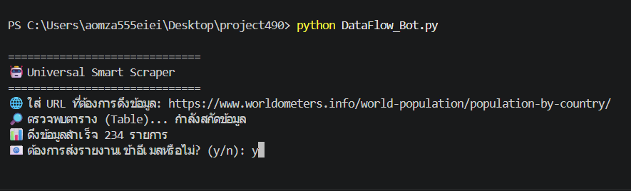
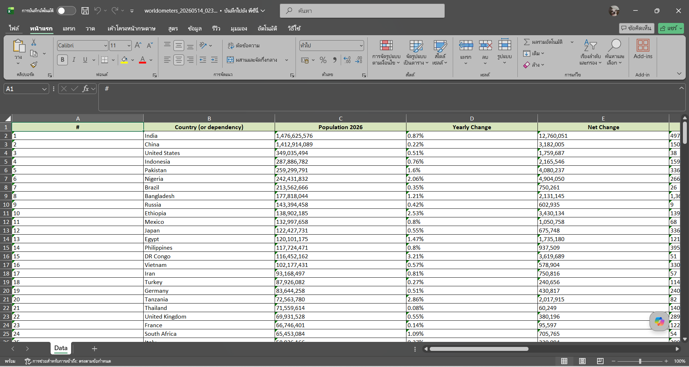
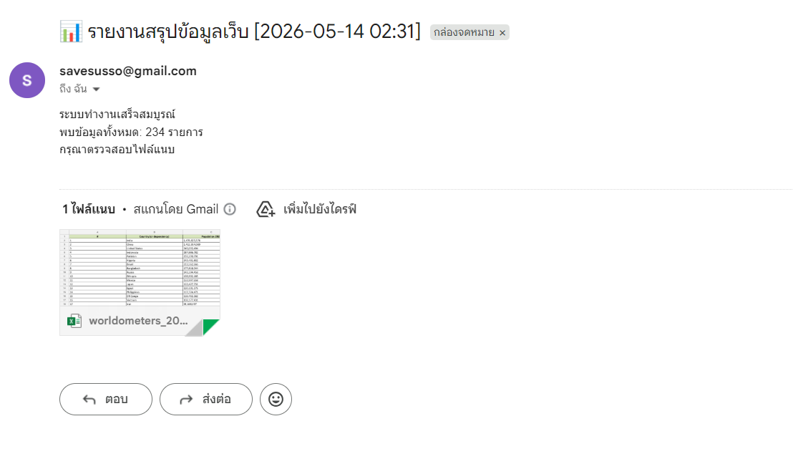

# 🤖 Universal Smart Scraper

A Python-based web scraping tool that automatically detects and extracts data from any website — tables or article content — then exports it as a formatted Excel file and sends a summary report via email.

---

## ✨ Features

- 🌐 **Universal URL Input** — Works with any website URL
- 🔎 **Smart Auto-Detection** — Automatically detects tables or article content
- 📊 **Excel Export** — Saves data as a formatted `.xlsx` file with styled headers
- 📧 **Email Report** — Sends a summary email with the Excel file attached
- 🧹 **Text Cleaning** — Removes garbled characters and extra whitespace

---

## 📸 Screenshots

| Running the Scraper | Excel Output |
|:---:|:---:|
|  |  |

| Email Report |
|:---:|
|  |

---

## 🛠️ Tech Stack

- **Python 3**
- **requests** — HTTP requests
- **BeautifulSoup4** — HTML parsing
- **pandas** — Data manipulation
- **xlsxwriter** — Excel formatting
- **smtplib** — Email sending

---

## 🚀 Installation & Usage

### 1. Clone the repository
```bash
git clone https://github.com/PanidaJwn/WebScraper-Auto-Report
cd WebScraper-Auto-Report
```

### 2. Install dependencies
```bash
pip install requests beautifulsoup4 pandas xlsxwriter
```

### 3. Configure email settings
Open `DataFlow_Bot.py` and edit:
```python
EMAIL_SENDER = "your_email@gmail.com"
EMAIL_PASSWORD = "your_app_password"
EMAIL_RECEIVER = "receiver@gmail.com"
```
> ⚠️ Use a **Gmail App Password**, not your regular password. Enable it at [myaccount.google.com/apppasswords](https://myaccount.google.com/apppasswords)

### 4. Run the program
```bash
python DataFlow_Bot.py
```

### 5. Enter the URL when prompted
```
🌐 ใส่ URL ที่ต้องการดึงข้อมูล: https://www.example.com/data
```

---

## 📁 Project Structure

```
universal-smart-scraper/
├── DataFlow_Bot.py       # Main script
├── output/               # Exported Excel files (auto-created)
├── screenshots/          # Screenshots for README
└── README.md
```

---

## 📋 How It Works

1. Enter a URL → program fetches the HTML
2. Detects a `<table>` → extracts rows and columns
3. No table found → extracts headings and article text
4. Saves data as a styled Excel file in `/output`
5. Optionally sends the file via email

---

## 👩‍💻 Developer

Made by **Panida** — 2026
